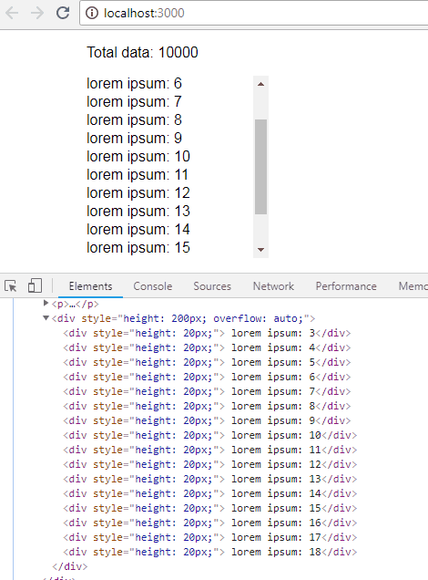

# virtual-list

> virtualize data list (In the process of experiment)

[](https://www.npmjs.com/package/virtual-list) [](https://standardjs.com)

## Usage



```jsx
import React from 'react'
import { VirtualList } from 'virtual-list'

const totalData = 10000;

const loadData = size => {
  return Array(size)
    .fill()
    .map((i, index) => " lorem ipsum: " + index);
};

export default class App extends React.Component {
  render() {
    const list = loadData(totalData);
    return(
      <VirtualList data={list} />
    );
  }
}
```

## License

MIT © [joelbarbosa](https://github.com/joelbarbosa)
